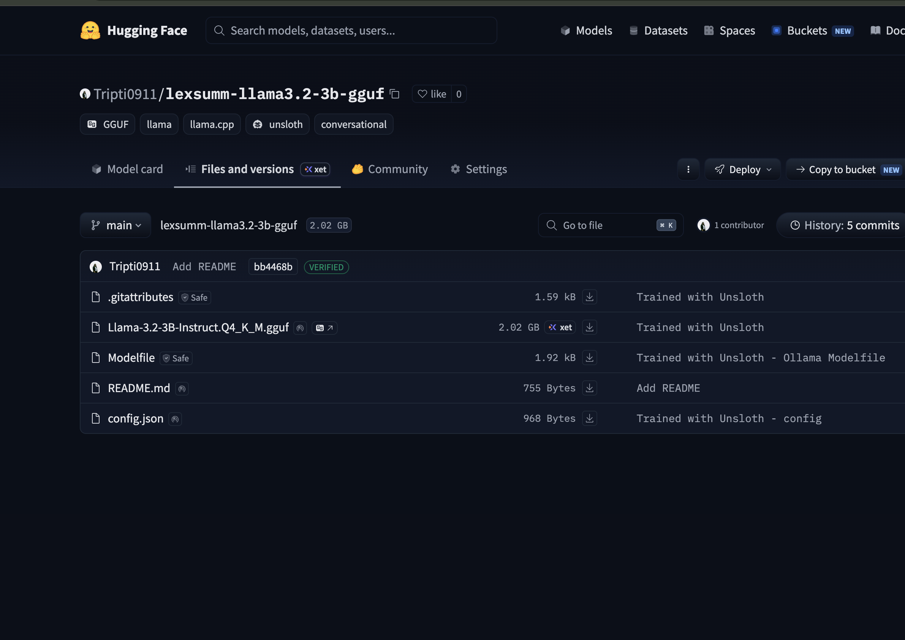
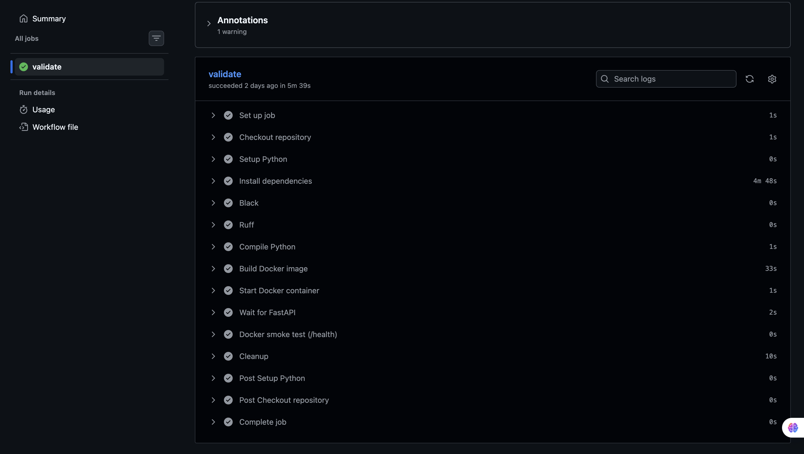
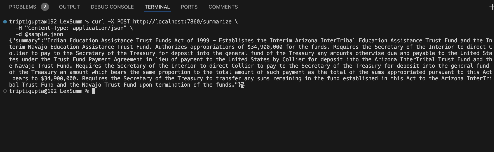
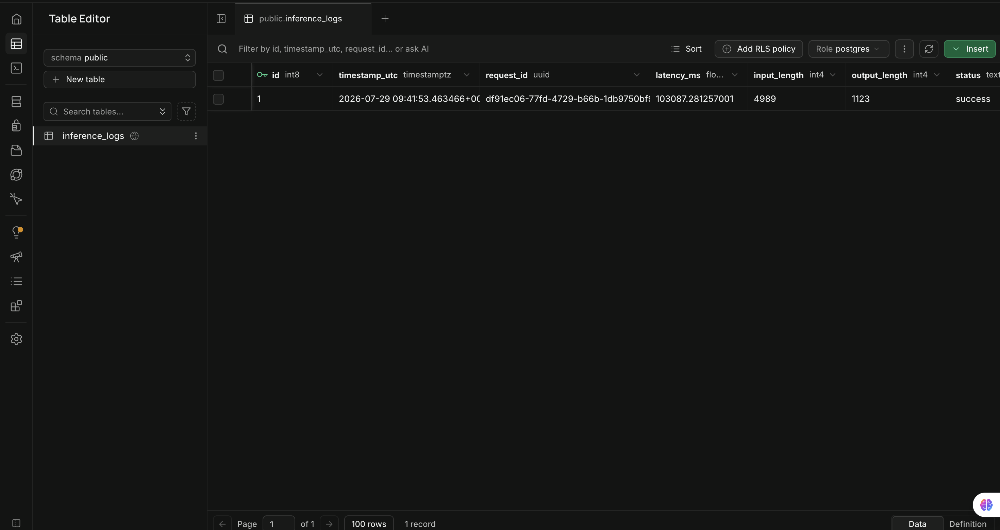
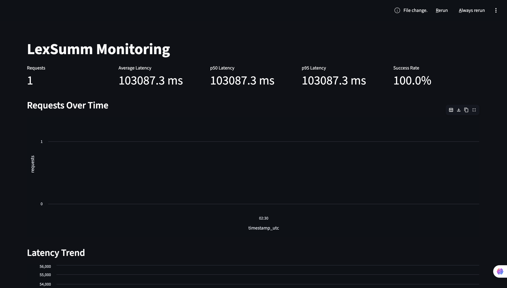

# LexSumm — LLMOps Pipeline for Legal Bill Summarization

An end-to-end LLMOps pipeline: fine-tune, evaluate, gate, serve, and monitor a domain-specific summarization model — built entirely on **free-tier infrastructure** to demonstrate the full production lifecycle, not just model training.

Fine-tunes **Llama-3.2-3B-Instruct** via QLoRA on the [BillSum](https://huggingface.co/datasets/FiscalNote/billsum) dataset to summarize U.S. Congressional bills in the standard legislative-summary style.

**Live artifacts:**
[Dataset](https://huggingface.co/datasets/Tripti0911/billsum-processed) · [Model (LoRA)](https://huggingface.co/Tripti0911/lexsumm-llama3.2-3b-lora-v1) · [Quantized GGUF](https://huggingface.co/Tripti0911/lexsumm-llama3.2-3b-gguf) · [CI](../../actions)


*Fine-tuned adapter and quantized GGUF versioned on Hugging Face Hub.*

---

## Architecture

```mermaid
flowchart LR
    A[BillSum Dataset] -->|clean, dedupe, split| B[HF Hub<br/>Data Registry]
    B -->|QLoRA on Kaggle T4| C[HF Hub<br/>Model Registry]
    C --> D{Eval Gate<br/>ROUGE + LLM Judge}
    D -->|beats champion| E[Promoted]
    D -->|does not beat champion| F[Rejected]
    E -->|merge + quantize| G[GGUF on HF Hub]
    G --> H[FastAPI + llama.cpp<br/>Docker]
    H -->|log every request| I[(Supabase)]
    I --> J[Streamlit Dashboard]

    style A fill:#1e3a5f,stroke:#4a90d9,color:#fff
    style B fill:#1e3a5f,stroke:#4a90d9,color:#fff
    style C fill:#3d2b1f,stroke:#c17a4a,color:#fff
    style D fill:#4a3b1f,stroke:#d9a84a,color:#fff
    style E fill:#1f3d2b,stroke:#4ad97a,color:#fff
    style F fill:#3d1f1f,stroke:#d94a4a,color:#fff
    style G fill:#1f3d2b,stroke:#4ad97a,color:#fff
    style H fill:#2b1f3d,stroke:#a84ad9,color:#fff
    style I fill:#2b1f3d,stroke:#a84ad9,color:#fff
    style J fill:#2b1f3d,stroke:#a84ad9,color:#fff
```



CI (GitHub Actions) lints, builds, and smoke-tests the container on every push. Orchestration is handled by a lightweight Prefect flow with a documented manual handoff for the GPU training step (see [Orchestration](#orchestration--cicd)).


*GitHub Actions: lint, Docker build, and health-check smoke test running on every push.*

---

## Stack — all $0

| Layer | Tool |
|---|---|
| Fine-tuning | Unsloth (QLoRA) on Kaggle T4 |
| Tracking | Weights & Biases |
| Registry | Hugging Face Hub (dataset + LoRA + GGUF) |
| Evaluation | ROUGE/BERTScore (local) + Gemini 2.0 Flash (LLM-as-judge) |
| Promotion | Custom champion/challenger gate |
| Serving | FastAPI + llama-cpp-python, Docker |
| CI/CD | GitHub Actions |
| Orchestration | Prefect |
| Monitoring | Supabase (Postgres) + Streamlit |

---

## Results

**ROUGE (200-example test set):**

| Metric | Score |
|---|---|
| ROUGE-1 | 0.490 |
| ROUGE-2 | 0.301 |
| ROUGE-L | 0.380 |

**Gemini-as-judge (12-example sample, 1–5 scale):**

| Relevance | Factual | Fluency | Overall |
|---|---|---|---|
| 3.42 | 3.50 | 3.92 | 3.61 |

**What the eval surfaced:** fluency is consistently strong, but relevance/factual scores are bimodal — the model either captures a bill's core provisions accurately or confidently summarizes the wrong section with equal fluency. It also shows two clear failure modes: **repeated verbatim clauses** on longer bills, and **truncation** at the token limit. All consistent with a 60-step fine-tune run intended to validate the pipeline, not a fully converged model — a longer run would likely close this gap.

---

## Pipeline Phases

**1. Data** — BillSum cleaned (boilerplate stripped, TeX quotes normalized), near-duplicate bills across sessions removed via prefix hashing, length-filtered to a 2048-token budget, and split 3000/300/200 with deterministic length-stratified sampling. Versioned on HF Hub as the data registry.

**2. Fine-tuning** — Llama-3.2-3B-Instruct, QLoRA (r=16) via Unsloth, run on Kaggle's free T4. Encountered and fixed two real upstream bugs: an Unsloth/Transformers loss-scaling incompatibility (`average_tokens_across_devices=False`) and a checkpoint-pickling crash from Unsloth's compiled-cache monkey-patching (resolved by disabling mid-run checkpoint saves, unneeded for a short validation run).

**3. Evaluation** — ROUGE/BERTScore locally, Gemini Flash as LLM-judge on a structured rubric (relevance/factual/fluency + reasoning), with markdown-safe JSON parsing and rate-limit backoff.

**4. Promotion gate** — Combines normalized ROUGE + judge scores into one comparable metric; a challenger only replaces the champion if it beats it beyond a threshold. Verified in both directions: the first checkpoint auto-promotes (no champion yet), and a synthetic worse challenger is correctly rejected without overwriting the champion.

**5. Serving** — LoRA merged and quantized to GGUF (Q4_K_M), served via FastAPI + `llama-cpp-python` in Docker. **Runs and is verified locally**, not hosted publicly: the model needs ~2GB RAM, which exceeds every free hosting tier checked (Render 512MB, Streamlit Cloud 1GB, HF Spaces Docker now requires a paid plan). An always-on host would run ~$25/mo (Render Standard, 2GB) — a deliberate cost/scope decision, not a limitation of the code.


*Container running locally, correctly summarizing a real bill via `curl`.*

**6. CI/CD** — GitHub Actions lints (Black/Ruff), builds the Docker image, starts the container, and polls `/health` until ready.

**7. Orchestration** — A Prefect flow chains dataset prep → (manual Kaggle training handoff) → evaluation → promotion. The GPU step is a documented manual handoff, since Kaggle training can't be triggered headlessly from a free-tier flow.

**8. Monitoring** — Every request logs to Supabase (latency, input/output length, status, model version) — text lengths only, not raw content. A Streamlit dashboard shows request volume, p50/p95 latency, success rate, and recent requests.


*A real logged request in the `inference_logs` table.*


*Streamlit dashboard showing live request volume, latency, and success rate.*

---

## Running It

```bash
# Data pipeline
python3 src/data_prep.py

# Evaluation (after training on Kaggle — see src/train.py)
python3 src/eval/rouge_eval.py
python3 src/eval/gemini_judge.py
python3 src/eval/aggregate_judge_scores.py
python3 src/eval/promote.py --update

# Serving (with monitoring)
docker-compose up --build
curl http://localhost:7860/health
curl -X POST http://localhost:7860/summarize \
  -H "Content-Type: application/json" \
  -d '{"text": "Full bill text here."}'

# Monitoring dashboard
streamlit run src/monitoring/dashboard.py
```

Requires a `.env` with `HF_TOKEN`, `HF_DATASET_REPO`, `HF_MODEL_REPO`, `WANDB_API_KEY`, `GEMINI_API_KEY`, and `SUPABASE_DB_URL` (pooler connection string — direct connections can fail to resolve from inside Docker).