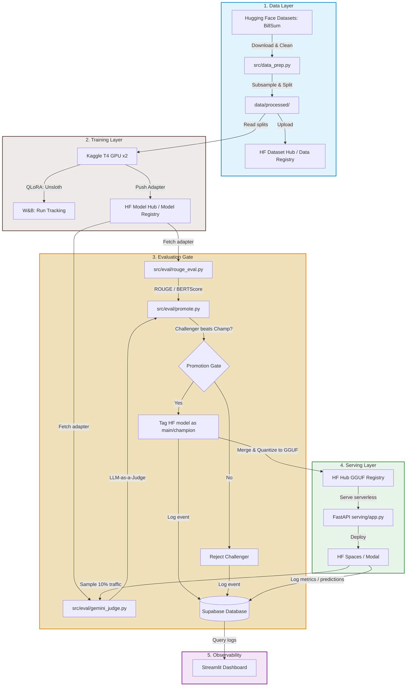

# LLMOps Pipeline: Domain-Specific Summarization Model (Legal Domain)

This repository contains a production-grade, end-to-end LLMOps pipeline designed for fine-tuning, evaluating, serving, and monitoring a domain-specific summarization model (using BillSum for legal bill summarization). The system is built leveraging a **zero-cost free-tier stack** to showcase high maturity constraint-driven design decisions.

---

## 🏛️ Architecture Overview

The pipeline implements an automated training, validation, serving, and monitoring loop. Below is the system flow:



---

## 🛠️ Technology Stack (Free-Tier Optimization)

| Layer | Tool | Rationale | Cost |
|---|---|---|---|
| **Fine-Tuning** | Unsloth + QLoRA | Fits 3B/4B models comfortably on free-tier T4 GPU (up to 2x faster, 70% memory reduction). | **$0** |
| **Experiment Tracking** | Weights & Biases | Free hosting for runs, config history, loss curves, and artifact tracking. | **$0** |
| **Model & Data Registry** | Hugging Face Hub | Host and version datasets & LoRA/GGUF model adapters natively. | **$0** |
| **Evaluation** | Local CPU + Gemini Flash | ROUGE/BERTScore compute locally. Gemini 2.0/2.5 Flash API serves as a low-cost, high-quality judge. | **$0** |
| **Serving** | HF Inference Endpoints / Spaces | Serverless scale-to-zero serving or free CPU container hosting for the API. | **$0** |
| **CI/CD** | GitHub Actions | Automatically run unit tests, check linting, and build/push FastAPI Docker image. | **$0** |
| **Orchestration** | Prefect (Local Process) | Lightweight automation. Triggers data checks and orchestrates Kaggle training via Kaggle API. | **$0** |
| **Monitoring** | Supabase + Streamlit | PostgreSQL logs requests (latency, inputs, outputs, cost). Streamlit hosts a public dashboard. | **$0** |

---

## 📊 Phase 1: Dataset Preparation

We use the US Congressional Bills **BillSum** dataset to fine-tune our summarizer. 

### Subsampling & Preprocessing Decisions (Why & How)

To build a reliable and budget-conscious fine-tuning dataset, we apply the following data preparation rules inside [src/data_prep.py](file:///Users/triptigupta/Desktop/LexSumm/src/data_prep.py):

1. **Length Constraint Filtering (The sequence budget):**
   * Pre-trained model context windows (such as Phi-3-mini or Llama-3.2) typically run with a 2048-token context window during training to optimize memory. 
   * A token is roughly 4 characters. To fit the instruction prompt, source text, and summary target within **2048 tokens**, we restrict text lengths to:
     * **Source text (Bill)**: between `1,500` and `6,000` characters.
     * **Summary**: between `200` and `1,500` characters.
   * If a bill is too short, it doesn't present a realistic summarization task. If it's too long, truncation will sever the tail-end of the bill and lead to incomplete summarizations.
2. **Quality Gate Cleaning:**
   * Removes congressional header boilerplate (e.g., sessions, H.R. numbers) using regular expressions.
   * Standardizes TeX-style quotes (normalizes `` ` `` `` and `''` to `"`) to keep tokenization clean.
   * Normalizes redundant whitespaces, newlines, and tabs.
   * **Near-Deduplication:** Prevents leakage of identical bills re-introduced in different congressional sessions with minor header edits. This is done by extracting the first ~800 characters of the bill, removing all non-alphanumeric characters, and dropping duplicates using the resulting normalized 500-character prefix hash.
   * Drops invalid/flipped examples. *(Note: Extractive shortcut checking is documented but omitted since BillSum summaries are professionally written abstracts.)*
3. **Deliberate Systematic Subsampling:**
   * To prevent sampling bias, we sort the cleaned and length-filtered corpus by character length and systematically extract **3,500** evenly-spaced examples.
   * This non-random approach guarantees that the training, validation, and test datasets represent an identical length distribution range of short, medium, and long bills.
4. **Deterministic Stratified Splits:**
   * Using length-based quantiles, we split the 3,500 pool into:
     * **Train**: 3,000 examples
     * **Validation**: 300 examples
     * **Test**: 200 examples
   * Stratification ensures the validation and test datasets represent the exact same length distributions as the training set, preventing evaluation skew.
   * The split process includes fallback error handling to guarantee reliability if stratification bins become fragile.

### Data Format
Each split is exported as a JSON Lines (`.jsonl`) file in the required instruction-style format:
```json
{
  "instruction": "Summarize the following legal bill.",
  "input": "...",
  "output": "..."
}
```

---

## 🚀 Setup & Execution

### 1. Installation
Clone the repository and install the dependencies:
```bash
pip install -r requirements.txt
```

### 2. Run Data Preparation & Registry Upload
To download, clean, filter, split, and optionally upload the dataset:

1. **(Optional) Configure environment variables for HF dataset registry:**
   ```bash
   export HF_TOKEN="your_hf_write_token"
   export HF_DATASET_REPO="your_username/billsum-processed"
   ```
2. **Execute the script:**
   ```bash
   python3 src/data_prep.py
   ```

This script outputs the processed files to:
* `data/processed/train.jsonl`
* `data/processed/val.jsonl`
* `data/processed/test.jsonl`

If `HF_TOKEN` and `HF_DATASET_REPO` are set, it automatically pushes the processed splits directly to your Hugging Face Datasets repository.

